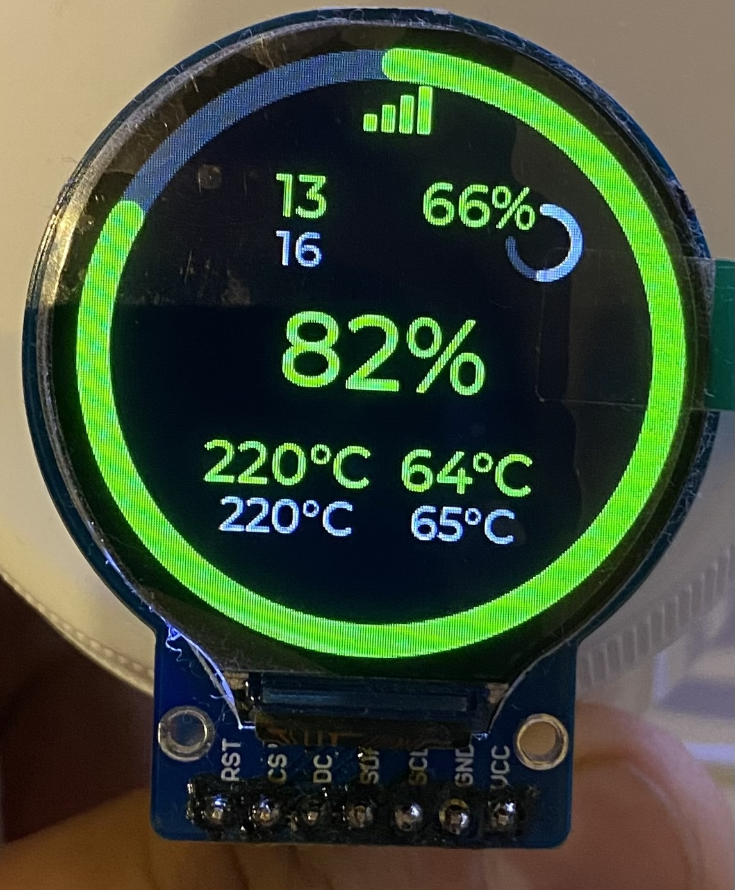

# XKN 2
eXtreme KNOMI forked from FlorianWilk

A complete rewrite of the Firmware for KNOMI. No GIF-Animations, just raw and beautiful data.
This rewrite also makes OTA (over-the-air) updates possible.

# Installation

Install VSCode and PlatformUI, open this project, copy myconfig_example.h, rename it to myconfig.h, change the settings according to your setup and upload the result to your KNOMI.

You can use a simple ESP32 Dev with 4Mb flash and no PSRAM
Round LCD GC9A01 conected as:

|Function|Pin|Description|
|---|---|---|
|MOSI|GPIO 23|SPI Data In (SDI/SDA)|
|SCLK|GPIO 18|SPI Clock|
|CS|GPIO 5|Chip Select|
|DC|GPIO 19|Data/Command (RS)|
|RST|GPIO 4|Reset|
|BL|GPIO 21|Backlight|

## ESP32-S3 SuperMini (4MB Flash / 2MB PSRAM)

Use PlatformIO environment `esp32s3supermini`.

Suggested GC9A01 wiring for this branch:

|Function|Pin|Description|
|---|---|---|
|MOSI|GPIO 11|SPI Data In (SDI/SDA)|
|SCLK|GPIO 12|SPI Clock|
|CS|GPIO 10|Chip Select|
|DC|GPIO 9|Data/Command (RS)|
|RST|GPIO 14|Reset|
|BL|GPIO 21|Backlight|

